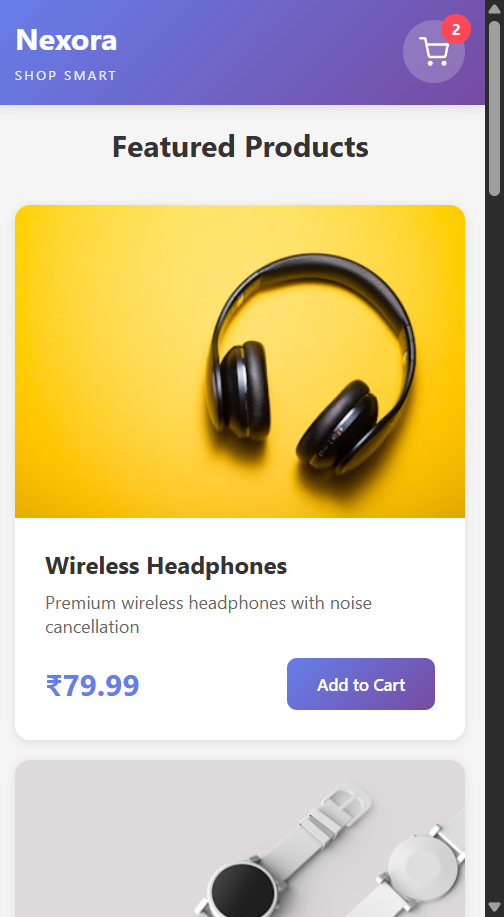

# Nexora

A simple e-commerce shopping cart built with the MERN stack. Think of it as a practice project that actually works - you can browse products, manage your cart, and complete orders.


## What's Inside

This is a full-stack shopping cart with everything you'd expect from a real e-store:

- Browse 8 tech products (headphones, watches, keyboards, etc.)
- Add stuff to your cart (quantities update automatically)
- Cart badge that shows how many items you've got
- Smooth sliding cart panel
- Checkout with basic validation
- Order confirmation with receipt
- Works on mobile too

**Tech stuff:**
- Frontend: React + Vite (because life's too short for slow builds)
- State: Context API (Redux felt like overkill here)
- Backend: Node.js + Express
- Database: MongoDB (but it'll work in-memory if you don't have Mongo running)
- Styling: Just CSS, no frameworks

## Quick Start

The fastest way to get this running:

```bash
# Install everything
npm run install:all

# Start both servers at once
npm run dev
```

Then open http://localhost:5173 and you're good to go.

### Or do it step by step:

**Backend:**
```bash
cd backend
npm install
npm start
```

**Frontend:**
```bash
cd frontend
npm install
npm run dev
```

MongoDB is optional - if it's not running, the app will just keep everything in memory instead.

## Project Structure

```
Nexora/
├── backend/              # Express API
│   ├── controllers/      # Where the logic lives
│   ├── models/           # MongoDB schemas
│   ├── routes/           # API endpoints
│   └── server.js
│
└── frontend/             # React app
    └── src/
        ├── components/   # UI pieces (Header, Cart, Modals)
        ├── context/      # Global cart state
        └── services/     # API calls
```

## API Endpoints

| What | Where | What it does |
|------|-------|-------------|
| GET | `/api/products` | Gets all products |
| GET | `/api/cart` | Gets your cart |
| POST | `/api/cart` | Adds item to cart |
| DELETE | `/api/cart/:id` | Removes item |
| POST | `/api/checkout` | Creates order and clears cart |

## How It Works

1. **Products** - Hit the homepage and you'll see 8 products in a grid
2. **Cart** - Click "Add to Cart" and the panel slides in from the right
3. **Checkout** - Fill in your name and email (basic validation)
4. **Receipt** - Get a confirmation with your order ID

The cart persists in MongoDB if you have it running. Otherwise it just stays in memory on the backend.

## Screenshots

### Main Page


### Cart


### Checkout


### Order Complete


### Mobile


*To add screenshots: Just run the app, take some pics, and drop them in the `screenshots` folder with these exact names.*

## A Few Notes

**Why MongoDB fallback?**
Sometimes you just want to test the frontend without setting up a database. The in-memory option means you can literally just clone and run.

**Why Context API?**
For a cart, you really only need to share state between a few components. Redux would be overkill here. Context is built-in and does the job fine.

**Why Vite?**
Have you tried Create React App lately? Vite is way faster. Dev server starts instantly and HMR is smooth.

**Demo user ID?**
The backend uses `demo-user-123` as the user ID. In a real app you'd have auth, but for a demo this keeps things simple.

## Testing the API

If you want to poke around with curl:

```bash
# See all products
curl http://localhost:5000/api/products

# Check your cart
curl http://localhost:5000/api/cart

# Add something
curl -X POST http://localhost:5000/api/cart \
  -H "Content-Type: application/json" \
  -d '{"productId":"some-id","qty":1}'
```

## Things That Could Be Added

- Real user auth (right now everyone is `demo-user-123`)
- Search and filters
- Quantity controls in the cart itself
- Order history
- Payment integration (Stripe, etc.)
- Admin panel to manage products

## Development

**Backend:**
- `npm start` - Runs the server
- `npm run dev` - Runs with nodemon (restarts on changes)

**Frontend:**
- `npm run dev` - Dev server with HMR
- `npm run build` - Production build

The backend runs on port 5000, frontend on 5173.

## Common Issues

**Port 5000 already in use?**
Something else is using that port. Either kill it or change the PORT in `backend/.env`

**MongoDB won't connect?**
No worries - the app will automatically fall back to in-memory storage. Everything still works.

**Products not showing?**
Make sure the backend is running. Check http://localhost:5000/api/products

## License

MIT - do whatever you want with this

---

Built with MongoDB, Express, React, and Node.js
